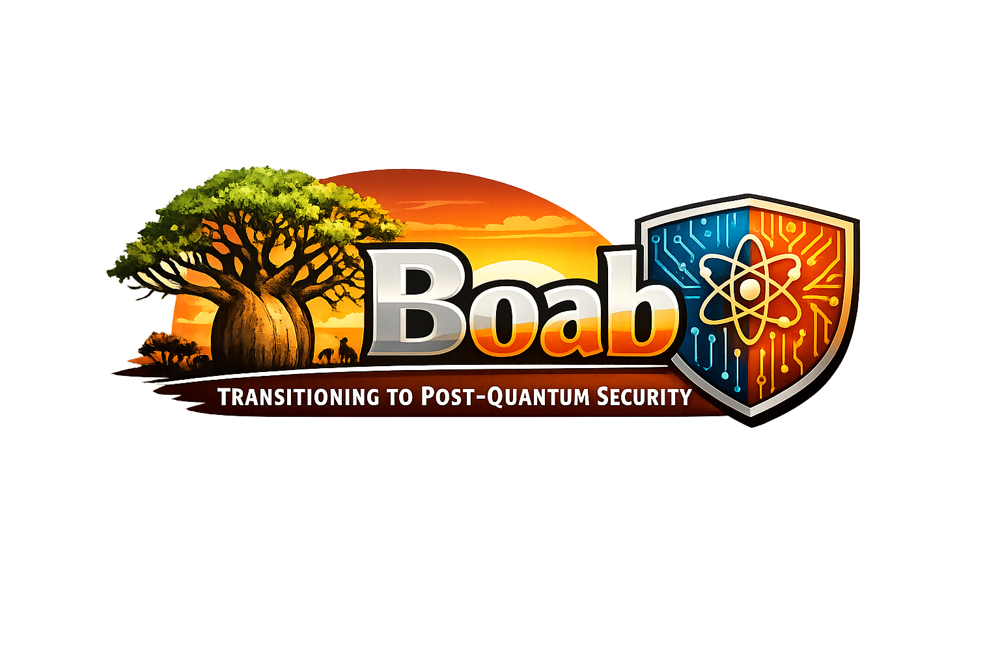

<p align="center">
  
</p>

# Boab

Boab is a Rust command-line tool that helps Australian organisations
prepare for and execute the transition to post-quantum cryptography
(PQC). It scans codebases, TLS endpoints, and certificate stores;
produces a deduplicated cryptographic inventory; scores assets against
a published risk rubric aligned to ASD guidance; generates transition
plans against the 2026, 2028, and 2030 milestones; and exports the
result as JSON, CycloneDX 1.6 CBOM, and Markdown reports.

Boab is air-gapped by default. The only outbound network connections
it makes are TLS handshakes against targets you supply.

## Why this exists

### The harvest-now-decrypt-later (HNDL) threat is already live

A sufficiently powerful quantum computer running Shor's algorithm
breaks the public-key cryptography that protects almost every
confidential channel on the public internet today, including RSA,
ECDSA, and Diffie-Hellman across all sizes in production use.
No such computer exists as of writing. The problem is that adversaries
do not need one yet to do harm. Encrypted traffic and stored ciphertext
captured today can be archived now and decrypted later, the moment a
cryptographically relevant quantum computer (CRQC) becomes available.

This is the HNDL attack. It is the central reason that PQC transition
is a today problem, not a 2030 problem. Any data with a confidentiality
horizon that extends past the arrival of a CRQC is at risk now, even
though the attack completes later. National security material,
long-lived medical and legal records, intellectual property, and
classified communications all sit in that risk band.

### NIST has standardised the replacement primitives

In August 2024, NIST finalised three post-quantum standards:

- **FIPS 203 ML-KEM** (formerly Kyber), a key encapsulation mechanism
  for hybrid TLS and other key exchange.
- **FIPS 204 ML-DSA** (formerly Dilithium), a digital signature scheme
  for code signing and certificates.
- **FIPS 205 SLH-DSA** (formerly SPHINCS+), a hash-based signature
  scheme with a different security argument to ML-DSA.

Draft FIPS 206 FN-DSA (Falcon) is expected to follow. These standards
are what Boab considers "resistant" when classifying assets.

### Australian government direction

The Australian Signals Directorate (ASD) and the Australian Cyber
Security Centre (ACSC) have published clear direction on PQC
migration. The headline obligations Boab is built around are:

- Have a refined PQC transition plan in place by **end of 2026**.
- **Begin implementation by 2028**.
- **Complete implementation by 2030**.

These dates align with the Cyber Security Strategy 2023 to 2030 and
the broader expectation that classical asymmetric primitives such as
SHA-1, 3DES, RSA below 2048 bits, and DSA below 2048 bits be retired
well before the 2030 deadline. The ASD Information Security Manual
(ISM) carries the operational controls. ASD-Approved Cryptographic
Algorithms (AACA) and ASD-Approved Cryptographic Protocols (AACP)
list the specific primitives and protocol versions approved for
Australian Government use; the AACA and AACP both gain post-quantum
entries as the transition progresses.

Organisations subject to the Security of Critical Infrastructure Act
2018 (SOCI) have additional incentive to move early: a successful
HNDL attack against SOCI-regulated data is precisely the kind of
incident the Act is designed to prevent. Boab supports a `--soci`
flag on systems so the rubric weighs criticality accordingly.

### Why a CLI, not a platform

PQC inventory and planning is a long-tail data problem. The hard part
is not running a single scan; it is producing a comprehensive,
deduplicated, auditable record of every place cryptography lives in
your estate, then keeping it current. A command-line tool that drops
into existing CI pipelines and produces machine-readable artefacts
beats a UI-led platform on three axes that matter to Australian
organisations:

1. **Air-gapped by default.** Boab makes no outbound network calls
   except for TLS scans against targets you specify. Suitable for
   classified networks and offline build environments.
2. **Auditable artefacts.** Every output (inventory, scan records,
   plans, reports) is a plain JSON or Markdown file you can diff,
   sign, and commit alongside your code.
3. **Open standard outputs.** Boab emits CycloneDX 1.6 cryptographic
   BOMs (CBOM), the open standard for crypto inventory exchange.
   Boards, regulators, and supply chain partners can consume the
   output without a Boab licence.

## What Boab does, end to end

1. **Inventory.** Walks your code with `.gitignore` semantics,
   detects algorithm references across Rust, Go, Python,
   JavaScript/TypeScript, Java/Kotlin, and .NET, and picks up cert
   and keystore files by extension. Adds TLS endpoint and certificate
   store findings.
2. **Deduplicate.** A shared pipeline collapses raw findings into
   canonical inventory entries by `(algorithm, parameters, source
   root)` for algorithms, by SHA-256 fingerprint for cert and key
   files, and by `(target, suite)` for TLS endpoints. Rerunning a
   scan does not introduce duplicates and preserves user annotations.
3. **Score.** Each inventory entry is scored on five axes:
   algorithm vulnerability, data sensitivity, harvest-now-decrypt-later
   exposure, system criticality, and migration difficulty. The
   weighted score lands every asset in one of four triage tiers.
4. **Plan.** Generates transition plans against the 2026, 2028, and
   2030 milestones with front-loaded target dates. Regenerating a
   plan preserves user edits (target dates, assignees, notes,
   status) when the underlying asset is unchanged.
5. **Report.** Exports the workspace state as native JSON, CycloneDX
   1.6 CBOM, or a board-ready Markdown readiness report.

## Scoring rubric

The asset risk score is:

```
priority = round(
    algo_vuln  * 0.30 +
    hndl       * 0.30 +
    data_sens  * 0.15 +
    sys_crit   * 0.15 +
    mig_diff   * 0.10,
    1
)
```

Triage tiers:

- **Tier 1.** Priority at or above 7 with migration difficulty at or
  below 6. Must be migrated inside the 2028 milestone window.
- **Tier 2.** Priority at or above 6, or hardware-locked and clearly
  vulnerable. Fits inside the 2028 milestone but harder.
- **Tier 3.** Algorithm vulnerability at or above 7 with migration
  scheduled inside the 2029 to 2030 window.
- **Tier 4.** Monitor only.

Algorithm vulnerability classes (selected):

| Score | Class |
| ----- | ----- |
| 10 | MD5, SHA-1, RSA-1024, DSA-1024, 3DES, RC4 |
| 9 | RSA-2048, ECDSA P-256, DH-2048, ECDH P-256 |
| 8 | RSA-3072 to 4096, ECDSA P-384/P-521, X25519, Ed25519 |
| 5 | PQ/T hybrid (e.g. X25519MLKEM768) |
| 1 | ML-KEM, ML-DSA, SLH-DSA, Kyber, Dilithium, Falcon |
| 0 | AES-256, SHA-256+, ChaCha20, HMAC-SHA256+ |
| 7 | Unknown (the conservative default) |

The full rubric, including every algorithm class and the boundary
behaviour, lives in `src/scoring.rs` with 100 percent unit coverage
on the boundary cases.

## Install

```sh
cargo install boab
```

Prebuilt binaries are published on the GitHub Releases page for
Linux (x86_64 musl, aarch64 musl), macOS (x86_64, aarch64), and
Windows (x86_64 MSVC) when releases are cut.

## Quickstart

```sh
# 1. Initialise a workspace inside your repo.
boab init

# 2. Describe the business systems in scope. Repeat per system.
boab system add \
  --name "Payments" \
  --classification protected \
  --criticality mission_critical \
  --soci \
  --lifetime-years 25

# 3. Scan a codebase.
boab scan codebase .

# 4. Scan a TLS endpoint or two.
boab scan tls api.example.com:443

# 5. Scan a directory of certificate files.
boab scan certs ./certs

# 6. Inspect the deduplicated inventory.
boab inventory list
boab inventory list --tier 1
boab inventory list --pqc-status vulnerable

# 7. Generate a transition plan for the 2028 milestone.
boab plan generate --milestone 2028

# 8. Produce the three outputs: machine-readable, supply chain, and board pack.
boab report --format json   --output board-pack.json
boab report --format cbom   --output bom.cdx.json
boab report --format md     --output readiness.md
```

## Air-gapped operation

`scanner.air_gapped = true` is the default in `.boab/config.toml`.
With air-gapped mode on, Boab refuses to perform HSTS probes against
TLS endpoints (the `--probe-hsts` flag returns an error). The TLS
scanner itself still connects to the user-specified targets to
complete the standard handshake; that is the only outbound traffic
Boab will ever emit.

For fully offline use, run TLS scans on an internet-facing relay and
ship the resulting `.boab/scans/<id>.json` files into your offline
workspace.

## Outputs

### Native JSON

Full workspace state for diffing across scan runs. Stable key order.

### CycloneDX 1.6 CBOM

Open-standard cryptographic bill of materials, JSON-encoded. Each
inventory entry maps to a `components[].type = "cryptographic-asset"`
with the appropriate `cryptoProperties` block (`algorithm`,
`certificate`, `related-crypto-material`, or `protocol`). Boab sets
`nistQuantumSecurityLevel` per asset so consumers can sort by NIST
security categories 1, 2, 3, or 5.

### Markdown readiness report

GitHub-flavoured Markdown intended to be screenshotted into a board
pack or pasted into a SteerCo update. Sections: executive summary,
ASD LATICE phase status, top 25 priority assets, triage tier
distribution, PQC status distribution, vendor PQC dependency
summary, plans on file, methodology appendix, generated-at footer.

## What Boab checks

Boab ships three scanners. Each emits findings into a shared dedup
pipeline that promotes them into the canonical inventory.

### Codebase scanner: languages and patterns

The codebase scanner walks the target path with `.gitignore`
semantics (default excludes: `node_modules`, `vendor`, `.venv`,
`venv`, `target`, `dist`, `build`, `.git`). For each file, Boab
applies a language-agnostic algorithm-name pattern pack plus a
per-language crypto-library import pattern pack.

**Languages detected by file extension:**

| Language | Extensions |
| -------- | ---------- |
| Rust | `.rs` |
| Go | `.go` |
| Python | `.py` |
| JavaScript / TypeScript | `.js`, `.mjs`, `.cjs`, `.ts`, `.tsx`, `.jsx` |
| Java / Kotlin | `.java`, `.kt`, `.kts` |
| .NET (C#, VB, F#) | `.cs`, `.vb`, `.fs` |
| Generic config | `.toml`, `.yaml`, `.yml`, `.json`, `.xml`, `.conf`, `.ini` |

**Algorithm literals detected in any file (high confidence):**

| Class | Algorithms |
| ----- | ---------- |
| Broken hashes | MD5, SHA-1 |
| Vulnerable RSA | RSA-1024, RSA-2048, RSA-3072, RSA-4096 |
| Vulnerable ECC | ECDSA-P-256, ECDSA-P-384, Ed25519, X25519 |
| Other broken primitives | 3DES, TripleDES, DES-EDE3, RC4 |
| Symmetric (safe) | AES-128 (GCM/CBC/CCM/CTR), AES-256 (GCM/CBC/CCM/CTR), ChaCha20, ChaCha20-Poly1305 |
| Modern hashes (safe) | SHA-256, SHA-384, SHA-512 |
| PQC standards | ML-KEM (512/768/1024), ML-DSA (44/65/87), SLH-DSA, Kyber, Dilithium |
| PQ hybrid signals | X25519MLKEM768 |

**JWT / JWA `alg` token values detected in source:**

| Token | Algorithm | PQC status |
| ----- | --------- | ---------- |
| `RS256` | RSA + SHA-256 | vulnerable |
| `ES256` | ECDSA P-256 | vulnerable |
| `EdDSA` | Ed25519 | vulnerable |
| `HS256` | HMAC-SHA-256 | symmetric_ok |

**Crypto library imports detected (medium confidence):**

| Language | Libraries |
| -------- | --------- |
| Rust | `ring`, `rustls`, `openssl`, `sha2` |
| Go | `crypto/*` standard library, `golang.org/x/crypto/*` |
| Python | `cryptography`, `pycryptodome` (Crypto), `hashlib`, `ssl`, `pyjwt` |
| JavaScript / TypeScript | `node:crypto` (require/import), `node-forge`, `tweetnacl`, `jsonwebtoken` |
| Java / Kotlin | `javax.crypto`, `java.security`, BouncyCastle (`org.bouncycastle`) |
| .NET | `System.Security.Cryptography` |

**Cert and key files detected by extension (low confidence
placeholder findings):** `.pem`, `.crt`, `.cer`, `.der`, `.p7b`,
`.p12`, `.pfx`, `.jks`, `.key`.

### TLS endpoint scanner: what it captures

For each `host:port` target, Boab attempts a TLS 1.3 handshake and
falls back to TLS 1.2 if needed. Per target it records:

- Negotiated TLS protocol version.
- Negotiated cipher suite (full IANA name).
- ALPN protocol if negotiated.
- Full certificate chain. For each certificate: subject, issuer,
  signature algorithm (OID and friendly name), public key algorithm
  and approximate key size in bits, validity window
  (`notBefore` / `notAfter`), and SHA-256 fingerprint.
- PQ hybrid group recognition by codepoint, including
  `X25519MLKEM768` (`0x11EC`) and `X25519Kyber768Draft00` (`0x6399`).

Defaults: 10 second connection timeout, 1 host per second rate limit
(overridable with `--rate-limit`). HSTS probing requires `--probe-hsts`
and is refused in air-gapped mode.

### Certificate store scanner: file types and fields

Walks a directory for files matching `.pem`, `.crt`, `.cer`, `.der`,
`.p7b`, `.p12`, `.pfx`, `.jks`. Parsing:

| Format | Parser | Notes |
| ------ | ------ | ----- |
| PEM (`.pem`, `.crt`, `.cer`, `.p7b`) | `x509-parser` | Multi-block files supported. |
| DER (`.der`) | `x509-parser` | |
| PKCS#12 (`.p12`, `.pfx`) | `p12-keystore` | Password via `--password-file`. |
| JKS (`.jks`) | placeholder only | Convert to PKCS12 with `keytool`. |

For every X.509 certificate Boab records subject, issuer, signature
algorithm OID and friendly name, public key algorithm OID and
friendly name, validity window, and SHA-256 fingerprint of the DER
bytes. Passwords are never logged or stored in `.boab/`.

### Algorithm risk classification

Every detected algorithm is mapped to a `pqc_status`:

- `vulnerable`: broken by Shor's or Grover's algorithm at production
  parameters, e.g. RSA, ECDSA, classic DH.
- `hybrid`: PQ/T hybrid such as `X25519MLKEM768`. Provides classical
  security today and post-quantum security in the long term.
- `resistant`: NIST FIPS 203/204/205 primitives (ML-KEM, ML-DSA,
  SLH-DSA) and their Round 3 predecessors (Kyber, Dilithium, Falcon).
- `symmetric_ok`: AES-128 or larger, SHA-256 or larger, ChaCha20.
  Quantum-resistant under Grover with doubled key sizes.
- `unknown`: Boab could not classify (defaults to a conservative
  vulnerability score of 7).

## Vendor PQC dependency registry

Boab bundles a starter registry of the vendors most Australian
organisations encounter inside an ASD-aligned ICT estate. Each entry
records the vendor's published PQC status and source URL. Customer
overrides live in `.boab/vendor-overrides.json` and merge on top by
`(vendor, product)`.

**Bundled coverage (26 products across 18 vendors):**

| Vendor | Product | Current PQC status |
| ------ | ------- | ------------------ |
| Microsoft | Windows | unknown |
| Microsoft | Azure | unknown |
| Microsoft | M365 | unknown |
| AWS | KMS | hybrid |
| AWS | ACM | unknown |
| AWS | TLS (s2n-tls) | hybrid |
| Google | Cloud | hybrid |
| Oracle | Database | unknown |
| Oracle | WebLogic | unknown |
| Cisco | IOS XE | unknown |
| Cisco | ASA | unknown |
| Cisco | Firepower | unknown |
| Palo Alto Networks | PAN-OS | unknown |
| Fortinet | FortiOS | unknown |
| F5 | BIG-IP | unknown |
| Citrix | NetScaler | unknown |
| Apache | httpd | unknown |
| Apache | Tomcat | unknown |
| nginx | nginx | unknown |
| OpenSSL | OpenSSL | hybrid |
| BoringSSL | BoringSSL | hybrid |
| BouncyCastle | Java | resistant |
| HashiCorp | Vault | unknown |
| CyberArk | PAM | unknown |
| Thales | Luna HSM | hybrid |
| Entrust | nShield | hybrid |

There is no live fetching. The registry is a code artefact that
refreshes via pull request, with the process documented in
`docs/vendor-registry.md`. Status values follow the same five-way
classification Boab uses elsewhere (`vulnerable`, `hybrid`,
`resistant`, `symmetric_ok`, `unknown`).

`unknown` is the honest default for any vendor that has not made a
public, dated PQC commitment. Boab does not synthesise optimistic
roadmap dates.

## Reading list

If you are coming to PQC migration for the first time, work through
these in order:

- ACSC and ASD PQC guidance pages (current version, search the
  cyber.gov.au and asd.gov.au sites for "post-quantum cryptography").
- The ASD Information Security Manual (ISM), in particular the
  cryptography chapter and AACA/AACP listings.
- The Cyber Security Strategy 2023 to 2030.
- NIST FIPS 203 (ML-KEM), 204 (ML-DSA), and 205 (SLH-DSA).
- NIST IR 8547 "Transition to Post-Quantum Cryptography Standards".
- CISA, NIST, and NSA joint guidance "Quantum-Readiness: Migration to
  Post-Quantum Cryptography" (referenced internationally).
- CycloneDX 1.6 specification, cryptographic asset model.
- Mosca's theorem: `Y + X > Z`, where Y is the time you need data to
  remain confidential, X is the time required to migrate, and Z is
  the time until a CRQC arrives. If `Y + X > Z`, you are already
  late.

## How Boab fits with your existing tooling

Boab is intentionally narrow. It does not try to replace:

- **SBOM tooling.** Boab's CBOM is complementary to a software BOM
  produced by tools like `cargo cyclonedx`, `syft`, or `cdxgen`. Boab
  records cryptographic posture; SBOM tooling records package
  posture. Many teams will produce both.
- **Vulnerability scanners.** Boab does not scan for CVEs. Pair it
  with Grype, Trivy, or a commercial scanner.
- **Secret scanners.** Boab does not scan for leaked credentials.
- **KMS or HSM management.** Boab will surface that a HSM appears in
  the inventory but will not manage keys for you.

Boab does try to do one thing well: produce an auditable, ASD-aligned
view of your cryptographic posture against the 2026/2028/2030
milestone clock.

## Out of scope for v1

KMS scanners, Kubernetes secret enumeration, SSH and GPG host key
inventory, live vendor PQC roadmap fetching, automatic remediation,
specific ISM control ID mapping, scoring weight overrides, HTML
reports, web UI, daemon mode, and multi-machine federation. These
are tracked in `docs/backlog-v1.1.md`.

## Project status

Boab is built in five phases:

- Phase 0: planning and crate selection.
- Phase 1: workspace foundation, models, scoring engine, CLI skeleton.
- Phase 2: codebase scanner with dedup pipeline.
- Phase 3: TLS endpoint and certificate store scanners.
- Phase 4: plan generation and vendor PQC registry.
- Phase 5: JSON, CBOM, and Markdown reports plus CI.

See `PLAN.md` for the planning document and the commit history for
the phase-by-phase build record.

## Licence

Dual licensed under either of:

- MIT licence (`LICENSE-MIT`)
- Apache Licence, Version 2.0 (`LICENSE-APACHE`)

at your option.

## A note on the name

A boab is a tree native to the Kimberley in Western Australia. It
hollows out as it ages and stores water inside, which is why
Indigenous people of the Kimberley have used boabs as containers,
shelters, and waypoints for thousands of years. The tool is named
for the same reason: it is a sturdy thing you walk up to in order
to find out what is inside.
